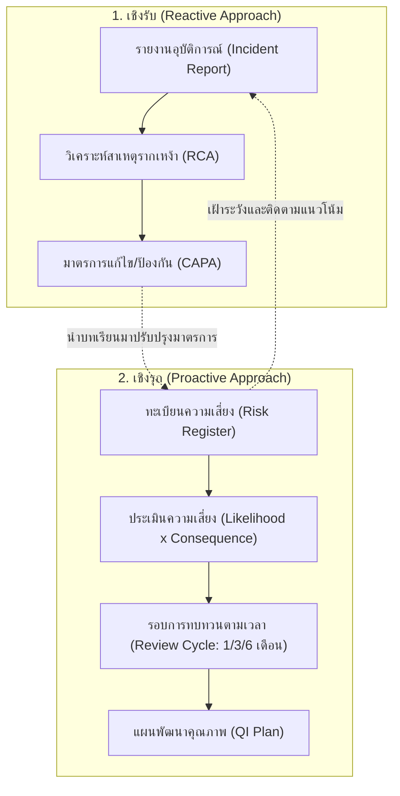
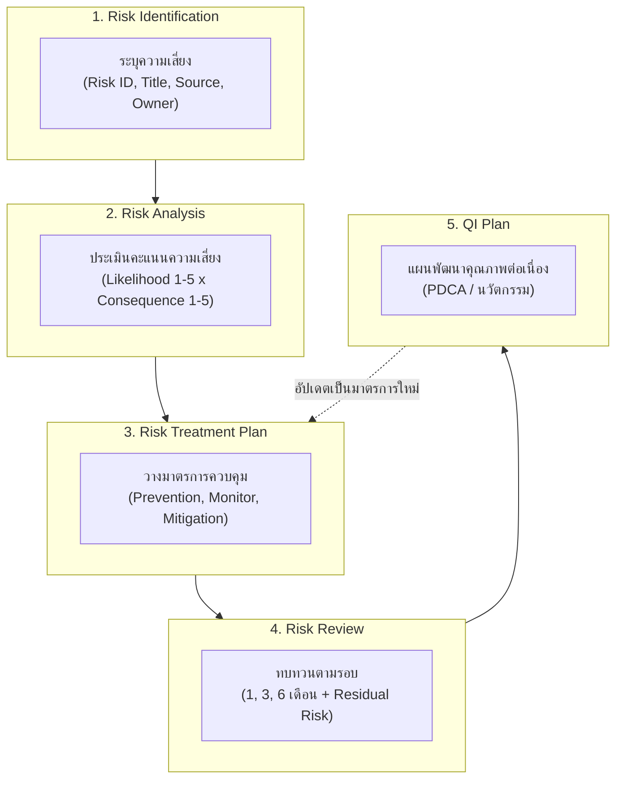
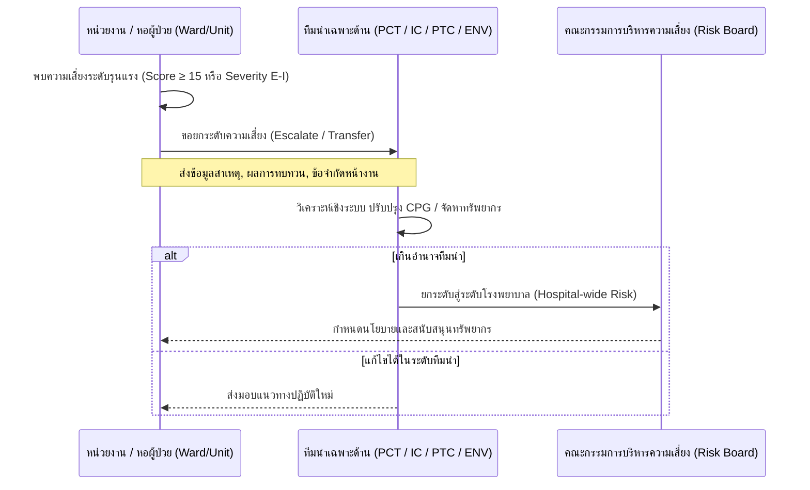

# คู่มือการใช้งานระบบบริหารจัดการความเสี่ยงโรงพยาบาล (Hospital Risk Management System - HRMS)
**ระบบบันทึกอุบัติการณ์ความเสี่ยง (Incident Report) และ ทะเบียนความเสี่ยงองค์กร (Risk Register)**

---

## สารบัญ (Table of Contents)
1. [บทนำและวัตถุประสงค์ของระบบ (Introduction & Principles)](#1-บทนำและวัตถุประสงค์ของระบบ)
2. [บทบาทและสิทธิ์ของผู้ใช้งาน (User Roles & Permissions)](#2-บทบาทและสิทธิ์ของผู้ใช้งาน)
3. [คู่มือโมดูลรายงานและจัดการอุบัติการณ์ (Incident Reporting & Investigation)](#3-คู่มือโมดูลรายงานและจัดการอุบัติการณ์)
   - 3.1 การรายงานอุบัติการณ์ใหม่ (New Incident Report)
   - 3.2 เกณฑ์การประเมินระดับความรุนแรง (Severity Rating Matrix)
   - 3.3 การตรวจสอบ รับเรื่อง และกระจายงาน (Triage & Assignment)
   - 3.4 การสืบค้นสาเหตุรากเหง้า (Root Cause Analysis - RCA)
   - 3.5 การกำหนดมาตรการแก้ไขและป้องกัน (CAPA)
4. [คู่มือโมดูลทะเบียนความเสี่ยงองค์กร (Risk Register Management)](#4-คู่มือโมดูลทะเบียนความเสี่ยงองค์กร)
   - 4.1 แนวคิดทะเบียนความเสี่ยงที่มีชีวิต (Living Risk Register)
   - 4.2 วงจรการจัดการความเสี่ยง 5 ขั้นตอน (5-Step Risk Lifecycle)
   - 4.3 ขั้นตอนที่ 1: การระบุความเสี่ยง (Risk Identification)
   - 4.4 ขั้นตอนที่ 2: การวิเคราะห์และประเมินระดับความเสี่ยง (Risk Analysis)
   - 4.5 ขั้นตอนที่ 3: แผนจัดการและควบคุมความเสี่ยง (Risk Treatment Plan)
   - 4.6 ขั้นตอนที่ 4: การติดตามและทบทวนตามรอบ (Risk Monitoring & Review)
   - 4.7 ขั้นตอนที่ 5: แผนพัฒนาคุณภาพต่อเนื่อง (QI Plan)
   - 4.8 การยกระดับและถ่ายโอนความเสี่ยง (Risk Escalation & Transfer)
5. [มาตรฐานรหัสความเสี่ยงและ 9 มาตรฐานสำคัญ (Taxonomy & 9 Essential Safety Standards)](#5-มาตรฐานรหัสความเสี่ยงและ-9-มาตรฐานสำคัญ)
6. [คู่มือการใช้งานแดชบอร์ดและการวิเคราะห์ (Dashboard & Analytics)](#6-คู่มือการใช้งานแดชบอร์ดและการวิเคราะห์)
7. [คำถามที่พบบ่อยและแนวทางแก้ปัญหา (FAQ & Troubleshooting)](#7-คำถามที่พบบ่อยและแนวทางแก้ปัญหา)

---

## 1. บทนำและวัตถุประสงค์ของระบบ

ระบบ **RiskHRMS (Hospital Risk Management System)** เป็นระบบบริหารจัดการความเสี่ยงทางการแพทย์และสิ่งแวดล้อมในสถานพยาบาล พัฒนาขึ้นตามมาตรฐานการรับรองคุณภาพโรงพยาบาล (**Hospital Accreditation - HA**) และแนวคิดความปลอดภัยของผู้ป่วยและบุคลากรสาธารณสุข (**2P Safety: Patient and Personnel Safety**)

### 1.1 วัตถุประสงค์หลัก
1. **สร้างวัฒนธรรมความปลอดภัยแบบไม่มุ่งโทษ (Non-Punitive / Just Culture)**: ส่งเสริมให้บุคลากรทุกระดับกล้ารายงานเหตุการณ์เกือบพลาด (Near Miss) และอุบัติการณ์จริง
2. **เปลี่ยนข้อมูลอุบัติการณ์สู่การป้องกันเชิงรุก**: เชื่อมโยงอุบัติการณ์รายวันเข้าสู่ทะเบียนความเสี่ยงของโรงพยาบาลและหน่วยงาน
3. **ติดตามและประเมินผลอย่างต่อเนื่อง**: มีระบบนัดหมายและเตือนรอบการทบทวน (Review Schedule) ไม่ปล่อยให้ความเสี่ยงถูกลืม
4. **สนับสนุนการทำงานของทีมนำ (Lead Teams)**: เช่น PCT, IC, PTC, ENV, IM/IT ให้มีข้อมูลสถิติที่ถูกต้องในการวางแผนยุทธศาสตร์

---

## 2. บทบาทและสิทธิ์ของผู้ใช้งาน

ระบบ RiskHRMS กำหนดระดับสิทธิ์การเข้าใช้งานออกเป็น 5 กลุ่ม ดังนี้:

| กลุ่มผู้ใช้งาน (Role) | สิทธิ์การเข้าถึงและหน้าที่หลัก |
| :--- | :--- |
| **1. บุคลากรทั่วไป (Staff / Reporter)** | • รายงานอุบัติการณ์ความเสี่ยงใหม่ (Incident Form) • ติดตามสถานะรายงานของตนเอง • ดูแนวทางปฏิบัติ (CPG/WI) ที่เกี่ยวข้อง |
| **2. ผู้รับผิดชอบความเสี่ยง / หัวหน้างาน (Risk Owner / Unit Head)** | • จัดการและทบทวน Risk Register ประจำหน่วยงาน • รับเรื่องและตรวจสอบอุบัติการณ์ที่เกิดขึ้นในแผนก • บันทึกผลการทบทวน (Review Result) ตามรอบเวลา • ยื่นเรื่องยกระดับ/ถ่ายโอนความเสี่ยง (Escalate) สู่ระดับโรงพยาบาล |
| **3. คณะกรรมการความเสี่ยง / ทีมนำเฉพาะด้าน (Risk Committee / Lead Teams: PCT, IC, PTC, ENV)** | • พิจารณาความเสี่ยงระดับโรงพยาบาลและ Never Events • ตรวจสอบและอนุมัติการทำ RCA สำหรับอุบัติการณ์ระดับรุนแรง (Level E-I หรือ 4-5) • กำหนดนโยบายและมาตรการป้องกันภาพรวมโรงพยาบาล |
| **4. ผู้บริหารโรงพยาบาล (Hospital Executives)** | • ดู Executive Dashboard และ Heatmap ภาพรวมทั้งโรงพยาบาล • อนุมัติทรัพยากร/งบประมาณสำหรับแผนจัดการความเสี่ยงวิกฤต • ติดตามดัชนีชี้วัดความปลอดภัย (Safety KPIs) |
| **5. ผู้ดูแลระบบ (System Administrator)** | • จัดการผู้ใช้งาน แผนก และสิทธิ์การเข้าถึง (RBAC) • ตั้งค่า Master Data: หมวดหมู่ความเสี่ยง, เมทริกซ์คะแนน, วันที่รอบทบทวน • สำรองข้อมูลและตรวจสอบความปลอดภัยระบบ |

---

## 3. คู่มือโมดูลรายงานและจัดการอุบัติการณ์

### 3.1 การรายงานอุบัติการณ์ใหม่ (New Incident Report)
1. เข้าสู่ระบบ เลือกเมนู **"รายงานความเสี่ยง / อุบัติการณ์"**
2. กรอกข้อมูลในแบบฟอร์ม:
   - **วัน/เวลาที่เกิดเหตุ** และ **วัน/เวลาที่รายงาน**
   - **สถานที่เกิดเหตุ** (หน่วยงาน/จุดเกิดเหตุ)
   - **ประเภทความเสี่ยง**: ทางคลินิก (Clinical) หรือ ทั่วไป/สิ่งแวดล้อม (Non-Clinical)
   - **หมวดหมู่ความเสี่ยง**: เช่น PT (ผู้ป่วย), PTC (ยา), IC (ติดเชื้อ), EN (กายภาพ), IM (ไอที)
   - **รายละเอียดเหตุการณ์**: บรรยายข้อเท็จจริงอย่างกระชับ ชัดเจน ระบุสิ่งที่เกิดขึ้น ผลกระทบ และการแก้ไขเบื้องต้น
   - **แนบไฟล์หลักฐาน** (รูปภาพ, เอกสาร, ผลตรวจ)
   - **ระดับความรุนแรงเริ่มต้น (Initial Severity)**

### 3.2 เกณฑ์การประเมินระดับความรุนแรง (Severity Rating Matrix)

#### ความเสี่ยงทางคลินิก (Clinical Risk: ระดับ A - I)
- **ระดับ A**: เหตุการณ์ที่มีโอกาสก่อให้เกิดความผิดพลาด แต่ยังไม่เกิด (Circumstance)
- **ระดับ B**: เกิดความผิดพลาดขึ้น แต่ยังไม่ถึงตัวผู้ป่วย (Near Miss)
- **ระดับ C**: เกิดความผิดพลาดถึงตัวผู้ป่วย แต่ไม่เกิดอันตราย (No Harm)
- **ระดับ D**: เกิดถึงตัวผู้ป่วย ต้องเฝ้าระวังหรือติดตามอาการเพิ่มเติม
- **ระดับ E**: เกิดอันตรายชั่วคราว ต้องได้รับการรักษา/ทำหัตถการแก้ไข
- **ระดับ F**: เกิดอันตรายชั่วคราว ทำให้ต้องนอน รพ. หรือนอนนานขึ้น
- **ระดับ G**: เกิดอันตรายถาวรแก่ผู้ป่วย สูญเสียอวัยวะหรือสมรรถภาพ
- **ระดับ H**: ต้องทำการกู้ชีพ (CPR / Life-support)
- **ระดับ I**: ผู้ป่วยเสียชีวิต (Death)

#### ความเสี่ยงทั่วไป / สิ่งแวดล้อม (Non-Clinical Risk: ระดับ 1 - 5)
- **ระดับ 1 (น้อยมาก)**: เสียหายน้อยกว่า 5,000 บาท หรือกระทบการทำงานเล็กน้อย
- **ระดับ 2 (น้อย)**: เสียหาย 5,000 - 20,000 บาท บาดเจ็บปฐมพยาบาลได้
- **ระดับ 3 (ปานกลาง)**: เสียหาย 20,000 - 100,000 บาท หยุดงาน < 3 วัน
- **ระดับ 4 (รุนแรง)**: เสียหาย 100,000 - 500,000 บาท บุคลากรบาดเจ็บสาหัส
- **ระดับ 5 (วิกฤต)**: เสียหาย > 500,000 บาท เสียชีวิต หรือกระทบชื่อเสียงรุนแรง

---

## 4. คู่มือโมดูลทะเบียนความเสี่ยงองค์กร (Risk Register Management)

### 4.1 แนวคิดทะเบียนความเสี่ยงที่มีชีวิต (Living Risk Register)
Risk Register ไม่ใช่เพียงเอกสารที่บันทึกไว้ครั้งเดียวแล้วเก็บใส่แฟ้ม แต่เป็น **เครื่องมือหลักในการกำกับติดตาม (Monitoring & Management)** โดยมีความเชื่อมโยงกับ Root Cause และทบทวนอย่างสม่ำเสมอ

---

### 4.2 วงจรและโครงสร้างข้อมูลทะเบียนความเสี่ยง (Risk Register Schema)

#### ขั้นตอนที่ 1: การระบุความเสี่ยง (Risk Identification)
| ฟิลด์ข้อมูล | คำอธิบาย | ตัวอย่าง |
| :--- | :--- | :--- |
| **Risk ID** | รหัสอ้างอิงความเสี่ยง | `PT/01`, `EN/16`, `IM/11` |
| **Date Added** | วันที่นำเข้าระบบ | `01/10/2567` |
| **Department** | หน่วยงานเจ้าของความเสี่ยง | `ER`, `IPD`, `IT`, `เภสัชกรรม` |
| **Source (แหล่งที่มา)** | แหล่งที่มาระบุความเสี่ยง | • มาตรฐานสำคัญ 9 ด้าน • รายงานอุบัติการณ์ • เรื่องที่องค์กรให้ความสำคัญ • เรื่องที่หน่วยงานให้ความสำคัญ • Proactive Risk / Never Event |
| **Risk Title** | ชื่อความเสี่ยงระดับภาพรวม | *ความคลาดเคลื่อนในการวินิจฉัยโรค*, *HOSxP ล่ม* |
| **Risk Description** | คำนิยามและรายละเอียดความเสี่ยง | อาการแสดง เงื่อนไข ประเภทความผิดพลาด (Missed/Wrong/Delayed) |
| **Risk Owner** | ผู้รับผิดชอบความเสี่ยง | ระบุชื่อแพทย์, พยาบาลหัวหน้าเวร หรือหัวหน้ากลุ่มงาน |

#### ขั้นตอนที่ 2: การวิเคราะห์และประเมินระดับความเสี่ยง (Risk Analysis)
คำนวณจากสูตร: $\text{Risk Score} = \text{Likelihood} \times \text{Consequence}$

| ระดับคะแนน (Score) | แถบสี | ระดับความเสี่ยง | แนวทางปฏิบัติ |
| :---: | :---: | :---: | :--- |
| **15 - 25** | 🔴 สีแดง | **วิกฤต (Extreme)** | ต้องทบทวนทุก 1 เดือน หรือทันทีที่มีเหตุ ต้องรายงานผู้บริหาร |
| **9 - 14** | 🟠 สีส้ม | **สูง (High)** | ทบทวนทุก 3 เดือน กำหนดมาตรการป้องกันอย่างเข้มงวด |
| **4 - 8** | 🟡 สีเหลือง | **ปานกลาง (Medium)** | ทบทวนทุก 6 เดือน มีแนวทางปฏิบัติกำกับหน้างาน |
| **1 - 3** | 🟢 สีเขียว | **ต่ำ (Low)** | ทบทวนทุก 6 - 12 เดือน ปฏิบัติตามมาตรฐานงานประจำ |

> **กฎพิเศษ (Never Events / Zero Events):**
> เหตุการณ์ที่ไม่ยอมให้เกิดขึ้นเด็ดขาด (เช่น ผ่าตัดผิดคน/ผิดข้าง, จ่ายยาแพ้ซ้ำ, ให้เลือดผิดหมู่) แม้มีโอกาสเกิดต่ำ (Likelihood = 1) แต่ผลกระทบวิกฤต จะต้องจัดให้อยู่ใน **ระดับความสำคัญสูงสุด (สีแดง)** เสมอ

#### ขั้นตอนที่ 3: แผนจัดการและควบคุมความเสี่ยง (Risk Treatment Plan)
1. **Risk Prevention & Transfer (มาตรการป้องกันและถ่ายโอน)**:
   - ออกแบบตามหลัก **Human-Centered Design** และ **Safety Design**
   - อ้างอิงเอกสารแนวทางปฏิบัติชัดเจน เช่น คู่มือปฏิบัติงาน (WI), ระเบียบปฏิบัติ (QP), หรือ CPG
   - การถ่ายโอนความเสี่ยง (Risk Transfer) เมื่อเกินขีดความสามารถ ให้ส่งต่อทีมนำ (PCT/คณะกรรมการ)
2. **Risk Monitor (การติดตามเฝ้าระวัง)**:
   - **Monitor Process**: ตรวจสอบการปฏิบัติตามเกณฑ์ (Compliance Audit)
   - **Monitor Results**: ติดตามสถิติอุบัติการณ์และตัวชี้วัดความปลอดภัย (KPI Report)
3. **Risk Mitigation (แนวทางบรรเทาความเสียหาย)**:
   - แผนเผชิญเหตุและขั้นตอนการจัดการทันทีเมื่อเกิดอุบัติการณ์ขึ้น เพื่อลดความสูญเสียให้เหลือน้อยที่สุด

#### ขั้นตอนที่ 4: การติดตามและทบทวนตามรอบ (Risk Monitoring & Review)
- **Review Frequency**: ความถี่ในการทบทวน (1 เดือน, 3 เดือน, 6 เดือน)
- **Next Review Date**: วันที่ครบกำหนดทบทวนรอบถัดไป (ระบบแจ้งเตือนอัตโนมัติ)
- **Result of Review (ผลการทบทวน)**: บันทึกข้อมูล:
  1. แนวโน้มอุบัติการณ์ที่เกิดขึ้นในรอบเวลา (ลดลง / เท่าเดิม / เพิ่มขึ้น)
  2. การปฏิบัติตามมาตรการป้องกันเดิมทำได้ครบถ้วนหรือไม่ พบอุปสรรคใด
  3. สาเหตุที่พบจากการวิเคราะห์ RCA มีอะไรเพิ่มเติม
- **Residual Risk Level (ระดับความเสี่ยงคงเหลือ)**: ประเมินความเสี่ยงที่ยังคงอยู่หลังบังคับใช้มาตรการ
- **Risk Status**: `เปิด (Open)`, `เฝ้าระวัง (Monitoring)`, `ปิด (Closed)`

#### ขั้นตอนที่ 5: แผนพัฒนาคุณภาพต่อเนื่อง (QI Plan)
- บันทึกโครงการทดลอง นวัตกรรม หรือการปรับเปลี่ยนขั้นตอนการทำงานเพื่อลดความเสี่ยง
- เมื่อผลการทดลองใน QI Plan พิสูจน์แล้วว่าได้ผลดี จะถูกยกระดับมาเป็น **มาตรการป้องกันถาวร (Prevention Measure)** ในรอบถัดไป

---

### 4.8 การยกระดับและถ่ายโอนความเสี่ยง (Risk Escalation & Transfer)

---

## 5. มาตรฐานรหัสความเสี่ยงและ 9 มาตรฐานสำคัญ

### 5.1 หมวดหมู่รหัสความเสี่ยง (Standard Taxonomy Prefix)
- **`PT` (Patient Safety)**: ความปลอดภัยของผู้ป่วย
  - `PT/01`: การระบุตัวผู้ป่วยผิดพลาด
  - `PT/02`: ผู้ป่วยพลัดตกหกล้ม / ตกเตียง
  - `PT/03`: Re-visit ER ภายใน 48 ชั่วโมงโดยไม่ได้วางแผน
  - `PT/19`: การคัดแยกผู้ป่วยฉุกเฉินคลาดเคลื่อน (Under/Over Triage)
  - `PT/21`: การวินิจฉัยโรคผิดพลาด / ล่าช้า
  - `PT/31`: การรายงานผลตรวจทางห้องปฏิบัติการผิดพลาด / ล่าช้า
  - `PT/33`: ผู้ป่วยอาการทรุดลงขณะรอตรวจ / ขณะรักษา
  - `PT/39`: Re-admit IPD ภายใน 28 วัน ด้วยโรคเดิม
- **`PTC` (Pharmacy & Therapeutics)**: ความเสี่ยงด้านยาและการใช้ยา
  - `PTC3/06`: การจ่ายยาที่ผู้ป่วยมีประวัติแพ้ซ้ำ
  - `PTC/01`: ความคลาดเคลื่อนทางยา (Medication Errors)
- **`IC` (Infection Control)**: การควบคุมและป้องกันการติดเชื้อ
  - `IC/01`: การติดเชื้อในโรงพยาบาล (HAP, CAUTI, SSI)
  - `IC/03`: ของมีคมทิ่มตำ / สัมผัสเลือดและสารคัดหลั่ง
  - `IC/04`: การใช้อุปกรณ์ป้องกันตนเอง (PPE) ไม่ถูกต้อง
  - `IC/05`: การล้างมือไม่ครบตามมาตรฐาน 5 Moments / 7 ขั้นตอน
  - `IC/06`: การคัดแยกและทิ้งขยะติดเชื้อไม่ถูกต้อง
- **`EN` (Environment & Safety)**: ความปลอดภัยด้านกายภาพและสิ่งแวดล้อม
  - `EN/10`: การสูบบุหรี่ในบริเวณสถานพยาบาล
  - `EN/14`: สัตว์มีพิษ / สัตว์พาหะนำโรคในบริเวณสถานพยาบาล
  - `EN/16`: อัคคีภัยและเหตุเพลิงไหม้
  - `EN/19`: ระบบไฟฟ้าและระบบสาธารณูปโภคขัดข้อง
- **`IM / IT` (Information Management)**: ระบบสารสนเทศและเทคโนโลยี
  - `IM/03`: ข้อมูลในระบบ HOSxP ไม่สมบูรณ์ / ไม่ขึ้น
  - `IM/09`: เครื่องสำรองไฟ (UPS) ไม่ทำงาน
  - `IM/10`: ซอฟต์แวร์หรือระบบเครือข่ายขัดข้อง
  - `IM/11`: ระบบ HOSxP ขัดข้อง / ล่ม
- **`MI` (Medical Instruments)**: เครื่องมือและอุปกรณ์ทางการแพทย์ชำรุดเสียหาย

---

### 5.2 9 มาตรฐานสำคัญจำเป็นต่อความปลอดภัย (9 Essential Safety Standards - HA)
โรงพยาบาลกำหนดให้ 9 ความเสี่ยงต่อไปนี้เป็นวาระสำคัญที่ต้องขึ้นทะเบียนใน Risk Register ระดับโรงพยาบาล:

1. **การผ่าตัดผิดคน ผิดข้าง ผิดตำแหน่ง ผิดหัตถการ** *(มาตรฐาน III-4.3)*
2. **การติดเชื้อที่สำคัญในสถานพยาบาล (SSI, VAP, CAUTI, CABSI)** *(มาตรฐาน II-4.2)*
3. **บุคลากรติดเชื้อจากการปฏิบัติหน้าที่ / สัมผัสของมีคม** *(มาตรฐาน II-4.2)*
4. **การเกิด Medication Error และ Adverse Drug Event (ADE)** *(มาตรฐาน II-6.1)*
5. **การให้เลือดผิดคน ผิดหมู่ ผิดชนิด** *(มาตรฐาน II-7.4)*
6. **การระบุตัวผู้ป่วยผิดพลาด** *(มาตรฐาน III-1)*
7. **ความคลาดเคลื่อนในการวินิจฉัยโรค (Missed / Delayed / Wrong Diagnosis)** *(มาตรฐาน III-2)*
8. **การรายงานผลการตรวจทางห้องปฏิบัติการ / พยาธิวิทยาคลาดเคลื่อน** *(มาตรฐาน II-7.2)*
9. **การคัดแยกที่ห้องฉุกเฉินคลาดเคลื่อน (Under / Over Triage)** *(มาตรฐาน III-1)*

---

## 6. คู่มือการใช้งานแดชบอร์ดและการวิเคราะห์

### 6.1 Interactive 5x5 Risk Matrix Heatmap
หน้าจอแสดงตารางกระจายตัวของความเสี่ยง 25 ช่อง (Likelihood แกนตั้ง 1-5 vs Consequence แกนนอน 1-5):
- คลิกที่ช่องสีเพื่อกรองดูรายการความเสี่ยงในกลุ่มนั้น
- ตัวเลขในแต่ละช่องแสดงจำนวนความเสี่ยงที่อยู่ในสถานะ **"เปิด (Open)"**
- สามารถสลับมุมมองระหว่าง **ระดับโรงพยาบาล (Hospital View)** และ **ระดับแผนก (Department View)**

### 6.2 การแจ้งเตือนรอบการทบทวน (Review Notifications)
- **แถบแจ้งเตือนสีแดง**: ความเสี่ยงที่เลยกำหนดวันทบทวน (Overdue)
- **แถบแจ้งเตือนสีเหลือง**: ความเสี่ยงที่ใกล้ถึงกำหนดทบทวนภายใน 15 วัน
- สามารถกดปุ่ม **"เริ่มบันทึกการทบทวน (Conduct Review)"** เพื่อกรอกผลและอัปเดตสถานะ

### 6.3 การส่งออกรายงาน (Export Reports)
- **Export to PDF**: รายงานทะเบียนความเสี่ยงสำหรับเตรียมรับการประเมินคุณภาพ HA
- **Export to Excel / CSV**: ส่งออกข้อมูลดิบเพื่อนำไปวิเคราะห์สถิติขั้นสูง
- **Incident vs Risk Comparison**: รายงานเปรียบเทียบสถิติอุบัติการณ์จริงกับความเสี่ยงที่ลงทะเบียนไว้

---

## 7. คำถามที่พบบ่อยและแนวทางแก้ปัญหา (FAQ & Troubleshooting)

**Q1: หากเกิดอุบัติการณ์ซ้ำบ่อยๆ แต่ความรุนแรงต่ำ ควรให้ระดับความเสี่ยงเป็นสีใด?**
> **ตอบ**: ให้คำนวณตามสูตร $L \times C$ หากเกิดบ่อยมาก ($L=5$) แม้ผลกระทบต่ำ ($C=2$) คะแนนจะเท่ากับ $10$ (สีส้ม) ต้องได้รับการทบทวนและกำหนดมาตรการป้องกันอย่างเป็นระบบ ไม่ควรปล่อยให้เป็นสีเขียว

**Q2: ความเสี่ยงที่ไม่เคยเกิดขึ้นในโรงพยาบาลเลย สามารถนำเข้า Risk Register ได้หรือไม่?**
> **ตอบ**: ได้ เรียกว่า **Proactive Risk** หรือความเสี่ยงเชิงรุก โดยเฉพาะเหตุการณ์ที่มีผลกระทบรุนแรงสูง (เช่น อัคคีภัย, ระบบไอทีหลักล่ม) เพื่อเตรียมแผนรับมือล่วงหน้า

**Q3: ใครเป็นผู้ปิดสถานะความเสี่ยง (Close Risk)?**
> **ตอบ**: การปิดความเสี่ยงต้องผ่านการพิจารณาร่วมกันในที่ประชุมทบทวนความเสี่ยงของหน่วยงาน หรือคณะกรรมการความเสี่ยง โดยต้องมีหลักฐานว่าไม่เกิดอุบัติการณ์ซ้ำ และมาตรการป้องกันถูกบรรจุเข้าสู่งานประจำอย่างยั่งยืนแล้ว

**Q4: ลืมรหัสผ่านหรือเข้าใช้งานระบบไม่ได้ ต้องทำอย่างไร?**
> **ตอบ**: ติดต่อผู้ดูแลระบบเทคโนโลยีสารสนเทศ (IT Department) หรือกดลิงก์ "ลืมรหัสผ่าน" ที่หน้าเข้าสู่ระบบเพื่อรับลิงก์รีเซ็ตรหัสผ่านทางอีเมล

---
*เอกสารนี้จัดทำขึ้นสำหรับระบบบริหารจัดการความเสี่ยงโรงพยาบาล (RiskHRMS)*
*เวอร์ชันเอกสาร: 1.0 | ปรับปรุงล่าสุด: 2 สิงหาคม 2569*
